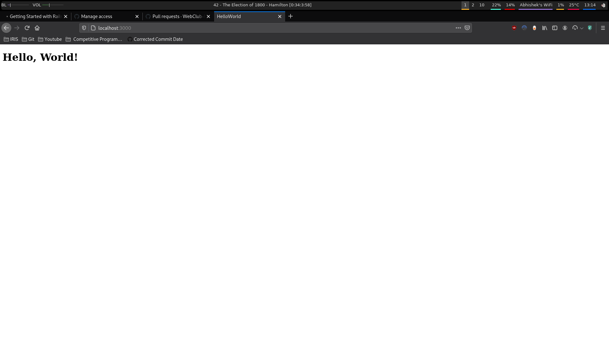
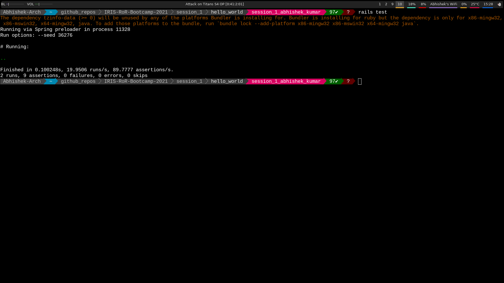

# Session 1 - Getting Started with Rails

The first sesssion is all about getting started with Rails.

We will create a website with two pages - a Home Page and an About Me
page.

The home page just contains a heading with text "Hello, World!" whereas
About Me page is more detailed, with the following elements:
- An heading with your name.
- An paragraph with your bio.
- An ordered list with four of your favorite hobbies.

For example, `@abhishekkumar2718`'s website looks like the following:




> The aim of session 1 is to become familiar with Rails and
> collaborating with others through Git. We will be building more
> impressive websites by the end of Bootcamp.

## Steps

- Install [Ruby Version Manager (RVM)](http://rvm.io/rvm/install). If
  you are using Ubuntu, [using the dedicated package](https://github.com/rvm/ubuntu_rvm)
  is the simplest way to install.

> RVM allows you to easily install, manage and work with multiple ruby
> environments.

- Install Ruby (2.7.2)

```bash
rvm install ruby-2.7.2
rvm --default use 2.7.2
```

- Create and use gemset `session_1`.

```bash
rvm gemset create session_1
rvm use 2.7.1@session_1
```

> A `gemset` is an isolated ruby setup. For example, you isolate two
> projects using Rails 5 and Rails 6 isolated from each other
> using a gemset.

> NOTE: Always switch to the appropriate gemset when working on a
> project. You can use a [project rvmrc](https://rvm.io/workflow/rvmrc)
> to automate this process.

- Install Bundler (2.2.0) and Rails (6.1.0)

```
gem install bundler --version 2.2.0
gem install rails --version 6.1.0
```

> While you can use different versions of Ruby, Bundler and Rails - we
> recommend using the provided versions as subsequent exercises are
> created and tested with the provided versions.

- Install [Git](https://git-scm.com/book/en/v2/Getting-Started-Installing-Git).

> Git is a software designed for coordinating work among programmers and
> tracking changes. We will be using Git to coordinate with other developers
> (i.e. Bootcamp mentors) by downloading and uploading exercises.
> Atlassian has great [Git Tutorials and Training](https://www.atlassian.com/git/tutorials).

- Clone and change directory into the repository

```bash
git clone https://github.com/abhishekkumar2718/IRIS-RoR-Bootcamp-2020.git
cd IRIS-RoR-Bootcamp-2020
```

> In Git terminology, a _repository_ is an independent project.
> _Cloning a repository_ is to make a copy of an existing project.
> Here, we are downloading the RoR bootcamp exercises.

- Create and checkout to a new branch `session_1_<your_name>`. For example:

```bash
git checkout -b session_1_abhishek_kumar
```

> A _branch_ represents an independent line of development. Thus,
> working in branches will help seperate your solutions from other
> student's solution as well as different sessions from each other.

- Create a new Rails project `hello_world` in the directory `session_1`:

```bash
cd session_1
rails new hello_world --skip-git
cd hello_world
```

> The command `rails new` initialises a Rails project. We have passed
> the flag `--skip-git` to avoid initializing Git again as we are
> already within a Git repository.

- Create a database and run the migrations using:

```bash
rails db:create
rails db:migrate
```

> A _database_ is a software to store and organize data. With databases,
> you don't have to worry *how* data is stored and can focus on the 
> rails application instead. A _database migration_ modifies the
> database schema i.e. tables, columns and entries in the database.

- Run the rails server using below command and go to http://localhost:3000/. 

```bash
rails server
```

You should see **Yay! You're on Rails!**:


- Generate a new controller `PageController` with actions `root` and
  `about_me`:

```bash
rails generate controller Page root about_me
```

> A _controller_ is responsible for making sense of request and producing
> the appropriate output. It acts as a middleman between the Data
> (Model) and Presentation (View). Controllers are stored in
> `app/controllers` directory.

> A _generator_ creates and fills out files with default code, making
> your job easier. For example, the above command creates a controller
> `PagesController`, creates view files `root.html.erb` and
> `about_me.html.erb` and modifies the routes file - with a single
> simple instruction.

- Edit the routes file (`config/routes.rb`) as follow:

```ruby
Rails.application.routes.draw do
  get '/', to: 'page#root'
  get 'about_me', to: 'page#about_me'
end
```

> The routes file specifies the URLs that are recognized by the
> application. In the above example, we can visit
> https://localhost:3000/about_me but not https://localhost:3000/contact
> as it is not specified in the routes file.

- Edit the view files (`app/views/page/root.html.erb`,
  `app/views/page/about_me.html.erb`).

> A _View_ displays data in a desired format. As we are building
> web pages, the desired format is _HTML_. The view files are stored in
> `app/views` directory.

- Reload the pages `http://localhost:3000` and
  `http://localhost:3000/about_me` (on your web browser) to inspect
  your changes.

- Copy the test file from `session_1` directory to
  `hello_world/test/controllers`:

```bash
cp page_controller_test.rb hello_world/test/controllers
```

> Since we are creating a new application, the test file cannot exist
> yet and must be copied into the application. In the later exercises,
> we will no longer need to copy tests.

- Execute the test suite to ensure the page works as expected.

```bash
rails test
```



- If the test fails, check the view files and debug the application.

- Once the test works locally, commit your changes and push:

```
git add .
git commit -m 'Solution for Session 1'
# Insert your branch name in the below command
git push --set-upstream origin session_1_abhishek_kumar 
```

> Submitting solutions to the repository is optional but highly
> recommended. Mentors can review your code, suggest improvements and
> applaud you for a job well done!

- Create a pull request through https://github.com/abhishekkumar2718/IRIS-RoR-Bootcamp-2020/pulls.

- If you have doubts, you can also comment on the pull request and
  request review from mentors (`abhishekkumar2718`, `yash-m-agrawal`).
